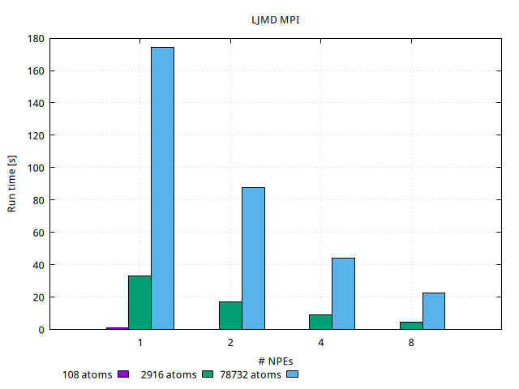
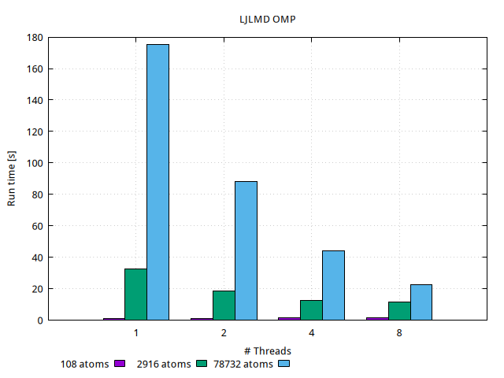
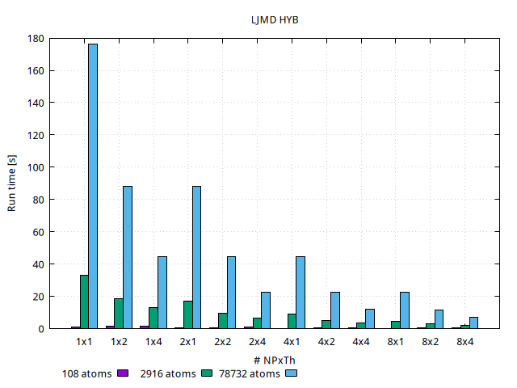
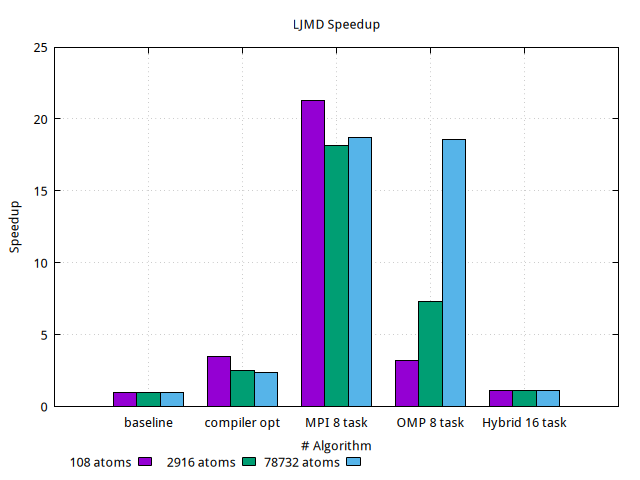

## A Simple LJ Many-Body Simulator - Optimization and Parallelization

### The LJ Model for Liquid Argon

Cubic box of particles with a Lennard-Jones type pair-wise additive interaction
potential.

### Build LJMD

LJMD is built as a library and and executable from source code using a build
environment generated by CMake.

#### Build LJMD with CMake

Building LJMD with CMake is a two-step process. In the first step, you use
CMake to generate a build environment in a new directory. For that purpose you
can use either the command line utility `cmake` or the terminal based curses
interface `ccmake`. The second step is the compilation and linking of all
objects, libraries, and executables using the selected build tool. Here is a
minimal example using the command line version of CMake to build LJMD with no
customization.

> **_NOTE:_**  LJMD currently requires that CMake version 3.10 or later is
> available

```shell
cd ljmd                 # change to the LJMD top level directory
mkdir build; cd build   # create and use a build directory
cmake ..                # read CMakeLists.txt in the top level directory
cmake --build .         # compile (or type "make")
```

This will create and change into a folder called *build*, then run the
configuration step to generate build files and then run the build command to
compile LJMD. During the configuration step CMake will try to detect wheter
support for the packages MPI and OpenMP are available and enable the
corresponding configuration settings. The progress of this configuration can be
followed on the screen. The `cmake --build .` command will launch the
compilation which will produce a library `libmdlib.so` and the LJMD executable
`ljmd.x` inside the build folder.

#### Build options
LJMD is written to use the MPI library for distributed memory parallel
computation. You need to have that library installed for building and running
LJMD in parallel.

##### Serial vs parallel build

> CMake build
> ```shell
> -D BUILD_MPI=value        # ON/OFF, default is ON if CMake finds MPI
> -D BUILD_OMP=value        # ON/OFF, default is ON is a compatible compiler is detected
> -D ENABLE_TESTING=value   # ON/OFF, default is OFF
> ```

### Results

#### MPI



#### OMP



#### Hybrid


#### Speedup comparison



