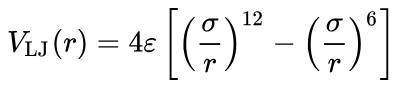
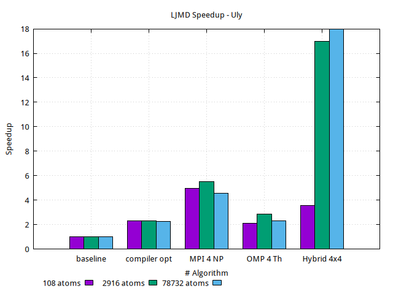

## A Simple LJ Many-Body Simulator - Optimization and Parallelization

This report shows the results of the optimization we performed for the Lennard-Jones Potential for Many-Body simulator. Throughout the work process, the three members of the group contributed hard. In general, the work was divided as follows:

 - Single-core optimization (assigned to Ludwig Asturias)
 - MPI parallelization (assigned to Giacomo Zuccarino)
 - OMP parallelization  (assigned to Gustavo Paredes)

 Mainly the optimizations focused on the force and Verlet functions, more than anything the force function was the one we worked on the most.

### The LJ Model for Liquid Argon

The Lennard-Jones potential is a simple model that still manages to describe
the essential features of interactions between simple atoms: Two
interacting particles repel each other at very close distance, attract each
other at moderate distance, and stop interacting if the distance is 
larger than
a defined cutoff (i.e. LJ potential is truncated).




### Build LJMD

LJMD is built as a library and and executable from source code using a build
environment generated by CMake.

#### Build LJMD with CMake

Building LJMD with CMake is a two-step process. In the first step, you use
CMake to generate a build environment in a new directory. For that purpose you
can use either the command line utility `cmake` or the terminal based curses
interface `ccmake`. The second step is the compilation and linking of all
objects, libraries, and executables using the selected build tool. Here is a
minimal example using the command line version of CMake to build LJMD with no
customization.

> **_NOTE:_**  LJMD currently requires that CMake version 3.10 or later is
> available

```shell
cd ljmd                 # change to the LJMD top level directory
mkdir build; cd build   # create and use a build directory
cmake ..                # read CMakeLists.txt in the top level directory
cmake --build .         # compile (or type "make")
```

This will create and change into a folder called *build*, then run the
configuration step to generate build files and then run the build command to
compile LJMD. During the configuration step CMake will try to detect wheter
support for the packages MPI and OpenMP are available and enable the
corresponding configuration settings. The progress of this configuration can be
followed on the screen. The `cmake --build .` command will launch the
compilation which will produce a library `libmdlib.so` and the LJMD executable
`ljmd.x` inside the build folder.

#### Build options
LJMD is written to use the MPI library for distributed memory parallel
computation. You need to have that library installed for building and running
LJMD in parallel.

##### Serial vs parallel build

> CMake build
> ```shell
> -D BUILD_MPI=value        # ON/OFF, default is ON if CMake finds MPI
> -D BUILD_OMP=value        # ON/OFF, default is ON is a compatible compiler is detected
> -D ENABLE_TESTING=value   # ON/OFF, default is OFF
> ```


### Initial Serial Code

In the following profiling we can see which functions we need to do more work on.


```shell
Flat profile:

Each sample counts as 0.01 seconds.
   %   cumulative   self              self     total
  time   seconds   seconds    calls  us/call  us/call  name
  73.22      3.24     3.24    10001   324.33   406.91  force
  16.61      3.98     0.74 346714668     0.00     0.00  pbc
   7.01      4.29     0.31                             _init
   2.03      4.38     0.09    30006     3.00     3.00  azzero
   0.90      4.42     0.04    10000     4.00   410.91  velverlet
   0.34      4.43     0.02    10001     1.50     1.50  ekin
   0.00      4.43     0.00      101     0.00     0.00  output
   0.00      4.43     0.00       12     0.00     0.00  get_a_line
```
Several of the features that are taking the most time can be worked on. Significant improvements have been made to most features.
### Results

The results for the different optimizations performed are shown. 
In each of the parallelization implementations, it is observed that the time scales as the available resources increase. Results obtained from Leonardo.

#### MPI
Resuls from Leonardo.


#### OMP
OMP results from Leonardo.


#### Hybrid

Hybrid results from Leonardo. 


#### Speedup comparison
Speedup comparison with the results from Leonardo.


The speedup in Ulysses in the next picture shows the same behavior as in Leonardo.



#### Summary 

A significant improvement is observed in all results but better speedups are shown for a higher number of atoms. A higher number of atoms provides more computational work that benefits from parallel processing, reducing the relative impact of communication overhead and serial execution parts, thus achieving better speedups.


